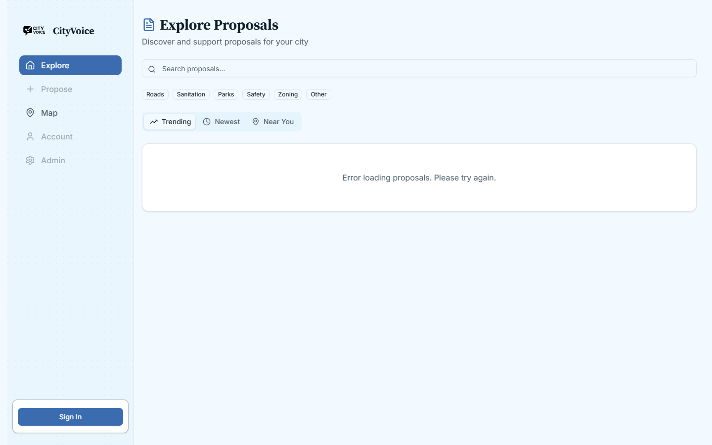
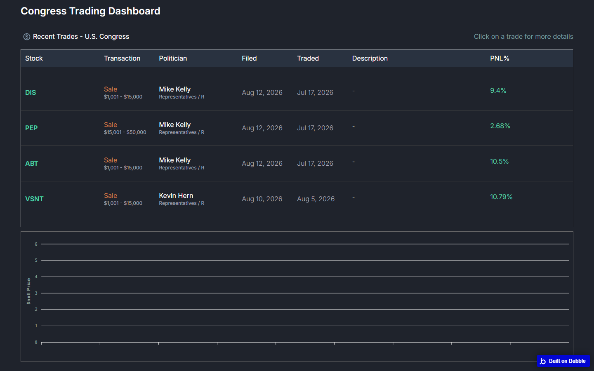
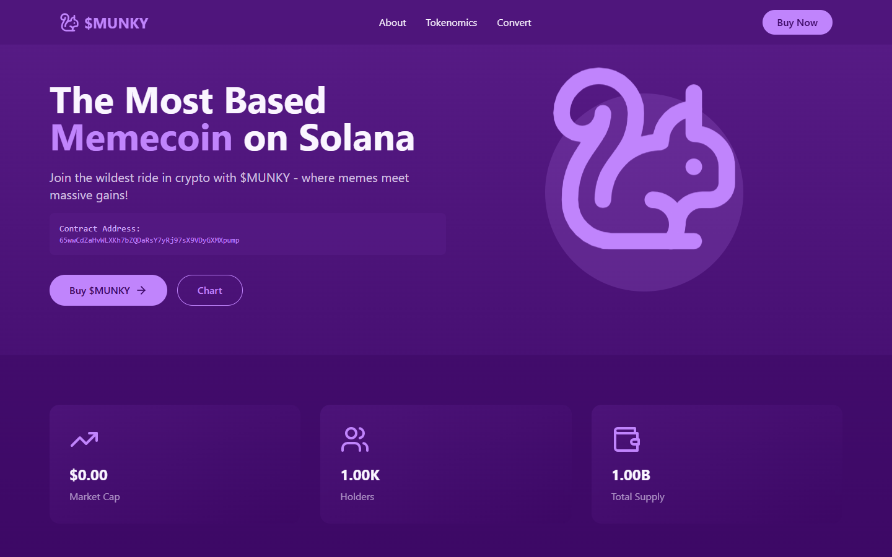

# Project evidence and media audit

This packet records what the new portfolio can state about the five current
projects using public evidence available on August 16, 2026. It does not change
the active portfolio. Claims that lack repository, product, event, or owner
evidence remain unpublished.

## Audit method

The audit compared current portfolio copy with primary project sources. Exa
returned 55 search results across a broad discovery pass and a targeted
per-project validation pass. The final findings rely on the live deployments,
GitHub repositories and commit history, and official Devpost event and project
pages. Search results that did not identify the same project were discarded.

Evidence strength uses these labels:

- **Verified:** A public primary source directly supports the claim.
- **Owner evidence required:** The public sources do not confirm the claim.
- **Conflict:** Current portfolio copy and public evidence disagree.
- **Unavailable:** The referenced source did not resolve or no longer exists.

## Decision summary

The current project inventory contains useful work, but none of the existing
case-study copy is ready to publish unchanged. Credify and CityVoice have the
strongest public evidence. Smartnest has credible repository history but its
live domain is unavailable. Stock Tracker has a working Bubble deployment but
no reachable source repository. `$Munky` has a working landing page and public
source, but the repository does not support the current wallet, traffic, or
business-outcome claims.

The provisional selected-work order is:

1. Credify, pending the Credify/Credily naming decision and corrected 2025 date.
2. CityVoice, pending the CityVoice/CitizenVoice naming decision and role
   confirmation.
3. Smartnest, pending a replacement live URL, archived media, and corrected
   timeline and stack.
4. Stock Tracker, pending source or owner evidence and a more specific public
   project name.
5. `$Munky`, pending scope confirmation and removal or proof of quantitative
   claims.

This is a proposal, not the approved selected-work order.

## Credify

Credify has the richest verified product-engineering story, but its public name
and date conflict with the current portfolio.

### Verified evidence

The [HackUTA 7 event](https://hackuta7.devpost.com/) ran October 4–5, 2025,
and its [project gallery](https://hackuta7.devpost.com/project-gallery?page=3)
lists Credify. The [Credify Devpost page](https://devpost.com/software/credify-zck3je)
describes location-aware card recommendations, Gemini insights, budgeting, and
transfer-rate comparison.

The [public repository](https://github.com/Tec94/hack-uta) was created on
October 4, 2025. It identifies three public contributors. Jack Cao is the
second-largest contributor by commit count. His public commits include the
initial interface, Plaid setup, nearby map pins, notifications, responsive
polish, theme and UX work, and Vercel deployment.

The repository directly verifies this implementation stack:

- React, TypeScript, Vite, Tailwind CSS, Framer Motion, and Zustand.
- Express, PostgreSQL, Gemini, Plaid, Mapbox, and Auth0 packages and routes.
- Card selection, bank linking, recommendation, budget, notification, and map
  interface code.

An evidence-safe role is **product and front-end engineer on a three-person
hackathon team, with Plaid integration, map interactions, responsive UI, and
deployment responsibilities**. The owner must confirm this wording before it
is published.

### Conflicts and unsupported claims

The current portfolio dates Credify to October 2024. Public event, repository,
and commit evidence dates it to October 2025. The repository and Devpost use
**Credify**, while the [live deployment](https://hack-uta.vercel.app/) uses
**Credily** in its title and hero.

No public evidence found in the audited sources supports these current claims:

- 15 or more cards and 30 or more spending categories.
- 40 percent lower API latency through caching.
- 95 percent AI accuracy.
- 1,000 or more test transactions.
- Zero security incidents.

The repository contains the integrations and product surfaces, but the numeric
results need a benchmark, dataset, test record, or owner evidence.

### Live and media state

The deployment loaded successfully during the audit. The current landing page
is usable as source material, but it is not enough for a product case study.

The case study still needs owner-supplied or newly captured states for:

- Onboarding and card selection.
- Plaid Link and its success, error, and reset states.
- The nearby recommendation map and notification flow.
- Budget and Gemini recommendation output.
- Mobile interaction and the final hackathon demo.

## CityVoice

CityVoice has the strongest award and collaboration story. Its public name,
date, live data state, and security copy need correction before publication.

### Verified evidence

The [HackRice 15 event](https://hackrice-15.devpost.com/) ran September 19–21,
2025. Its [project gallery](https://hackrice-15.devpost.com/project-gallery)
marks CityVoice as a winner. The
[CityVoice Devpost page](https://devpost.com/software/cityvoice) verifies the
proposal, voting, road-reporting, mapping, PostGIS, Supabase, and Auth0 concept.

The [public repository](https://github.com/Tec94/Hack-Rice) was created in
October 2025 from work committed during September 2025. It identifies three
public contributors. Jack Cao has the highest public commit count. His commit
history includes the UI revamp, Supabase implementation, vote counter and
proposal-card work, final interface changes, Auth0 configuration, and Vercel
deployment.

An evidence-safe role is **product and front-end engineer on the CityVoice
hackathon team, with UI, Supabase, voting, Auth0 configuration, and deployment
responsibilities**. The owner must confirm this wording and any backend work
before publication.

### Conflicts and unsupported claims

The current portfolio calls the project **CitizenVoice** and dates it to
September 2024. The live product and Devpost use **CityVoice**, and the event
and commit history date it to September 2025. The repository README still uses
CitizenVoice, so the canonical name requires an owner decision.

The repository contains 14 named row-level security policies, but the audited
schema uses broadly permissive `USING (true)` and `WITH CHECK (true)` clauses
for several write operations. It does not support the current claims of strict
record isolation or enterprise-grade security. Do not publish the current
12-plus-policy or 100-percent-isolation claims.

No public evidence found supports the current 60 percent request-reduction
claim. The Auth0 award is supported by a winner badge and a
[participant account](https://www.linkedin.com/posts/quan-do-4b5741277_this-past-weekend-i-had-the-opportunity-activity-7378164621158879232-KKng),
but the exact prize title must be confirmed by the owner before the case study
uses it as a headline.

### Live and media state

The deployment loaded its interface during the audit, but its proposal request
settled into **Error loading proposals**. That state must not be used as the
primary case-study hero.

The case study needs owner-supplied or repaired states for:

- A populated proposal index and proposal detail.
- Proposal creation and vote feedback.
- Road reporting, photo upload, and map or heatmap views.
- Sign-in and resident-verification states.
- Admin review, mobile layouts, and the award or demo moment.

## Smartnest

Smartnest can demonstrate solo product-site engineering, but its public date,
technology description, performance metrics, and live availability conflict
with the current portfolio.

### Verified evidence

The [public repository](https://github.com/Tec94/smartnest) was created on
February 18, 2025, and lists Jack Cao as its sole public contributor. Commit
history directly supports work on interface themes, pricing presentation,
mobile navigation, routing, analytics, contact email, image and SEO
optimization, sitemap generation, and Vercel Speed Insights.

The package manifest verifies Vite, React, TypeScript, Tailwind CSS, routing,
forms, analytics, Speed Insights, Resend, and a broad component toolkit. It
does not contain Next.js, even though the repository README says Next.js.

An evidence-safe role is **sole public repository contributor responsible for
the product-site interface, responsive behavior, routing, contact flow, SEO,
analytics, and deployment instrumentation**. The commercial relationship and
project ownership still require owner confirmation.

### Conflicts and unsupported claims

The current portfolio dates Smartnest to April–June 2024. Public repository and
commit evidence dates it from February–June 2025. The current copy calls the
implementation Next.js, while the checked package and scripts use Vite.

No auditable report supports the current 95-plus Lighthouse, 0.8-second load,
65 percent speed improvement, 24-component, or under-two-minute deployment
claims. These metrics require saved Lighthouse output, deployment logs, or
another dated measurement.

### Live and media state

The [Smartnest domain](https://smartnest.health/) returned a DNS resolution
failure during the audit. No current live capture was possible.

The case study needs:

- A working deployment URL or archived production build.
- Desktop and mobile hero, pricing, product, and contact states.
- A dated performance report if performance remains part of the story.
- Confirmation of whether this was client, freelance, or self-directed work.

## Stock Tracker

Stock Tracker has a working public product state, but the current repository
link is missing and its quantitative outcomes have no public support.

### Verified evidence

The [Bubble deployment](https://stock-tracker-41285.bubbleapps.io/version-test)
loaded successfully during the audit. Its page title is **Insider Trading** and
its main interface is a **Congress Trading Dashboard** with current trade rows,
transaction ranges, politicians, dates, and PNL percentages. The public screen
also displays an empty chart area.

The implementation can safely be described as a Bubble dashboard that displays
congressional trade data. The current QuiverQuant and broader workflow claims
need owner or editor evidence.

### Missing and unsupported evidence

The current [GitHub repository URL](https://github.com/Tec94/stock-tracker)
returns 404. No public source establishes Jack Cao's role, the implementation
period, or the dashboard workflow.

No public evidence found supports these current claims:

- 50,000 or more processed data points.
- Sub-two-second update latency.
- 99.9 percent uptime.
- 15 or more automated workflows.
- 90 percent less manual tracking.
- A tracked portfolio value above $100,000.

The owner must provide the Bubble editor, workflow screenshots, a restored
repository, or another implementation record before these claims are used.

### Media needs

The case study needs a product name decision and stronger states for:

- Filters and navigation between data sets.
- Trade detail and chart interaction.
- Loading, empty, error, and populated states.
- Bubble workflows, API calls, and data mapping.
- A short recording of the working interaction rather than only a dashboard
  still.

## `$Munky`

`$Munky` provides visual range, but public code supports a small token landing
page rather than the current full Web3 product and growth story.

### Verified evidence

The [public repository](https://github.com/Tec94/munky-sol) was created on
December 29, 2024, and lists Jack Cao as its sole public contributor. It
contains a React, TypeScript, Vite, and Tailwind landing page with tokenomics,
price conversion, token-data hooks, and Solana API utilities.

The [live deployment](https://munky-sol.vercel.app/) loaded successfully. It
currently displays the `$MUNKY` contract address, tokenomics, a converter, a
zero-dollar market cap, 1,000 holders, and one billion total supply.

An evidence-safe role is **sole public repository contributor for a React and
Vite token landing page with token-data and conversion interfaces**. Client or
team context requires owner confirmation.

### Unsupported claims

The package manifest contains no MetaMask, WalletConnect, or Solana wallet
adapter dependency. The public code and current deployment do not support the
current claims that Jack led wallet-flow development or achieved zero failed
transactions across 10,000-plus on-chain interactions.

No public evidence found supports the current claims of $2 million peak volume,
8,500 holders, 20 percent daily growth, 1,000-plus concurrent users, or a
50 percent time-to-interactive reduction. The current live holder value also
conflicts with 8,500. Historical analytics or owner evidence are required.

### Media needs

If this project remains selected, the case study needs:

- Clarification of client, team, and individual ownership.
- Evidence for any historical market or traffic outcome.
- Converter loading, success, and error states.
- Mobile captures and a short interaction recording.
- A clear editorial reason for including a speculative token project in a
  product-engineering portfolio.

## Cross-project claim policy

The new portfolio must use a narrower claim policy than the current experience.
Implementation facts can come from public code and products. Outcome facts need
a saved measurement, attributable product record, or explicit owner statement
that can be defended in an interview.

Until evidence is supplied, exclude these claim classes:

- Percent improvements without a baseline and measurement method.
- Uptime, concurrency, traffic, transaction, and accuracy numbers.
- Security guarantees and zero-incident claims.
- Revenue, market-volume, holder, and growth claims.
- Production language for hackathon demos with broken or mocked dependencies.

## Approval gate

Stage 6 stops here. No project is moved into MDX or selected work until the
owner resolves the following decisions:

1. Confirm the canonical names and dates: Credify or Credily in October 2025,
   CityVoice or CitizenVoice in September 2025, and Smartnest in 2025 unless
   private evidence establishes an earlier timeline.
2. Confirm Jack Cao's exact individual role on Credify and CityVoice, and the
   client or ownership context for Smartnest, Stock Tracker, and `$Munky`.
3. Approve, remove, replace, or reorder the five projects in the provisional
   selected-work order.
4. Supply evidence for any quantitative claim that must survive, plus archived
   or private product states that are not publicly accessible.
5. Approve Credify as the first case-study template, or choose a different
   project.

## Next steps

After owner approval, update the project manifest with evidence-safe metadata,
art-direct the approved media, and convert one approved outline into the first
MDX case study. Do not mass-produce the remaining case studies until the first
one is reviewed.
